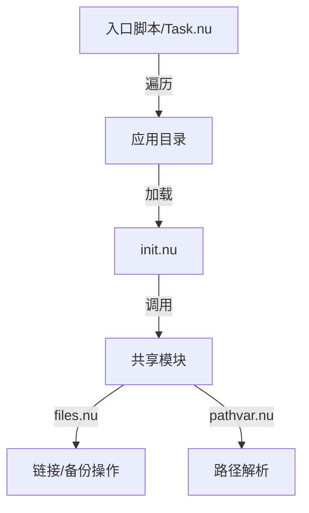

# 设计文档：Nushell 配置管理系统

## 1. 系统架构概览

本系统采用去中心化的架构设计，将配置管理的逻辑分散到各个应用的独立目录中，通过共享的 Nushell 模块提供底层能力（如路径解析、符号链接创建、跨平台适配）。



## 2. 目录结构设计

```text
dev-home/
├── nushell/
│   ├── modules/          # 核心功能库
│   │   ├── files.nu      # 文件操作（软链、备份、检测）
│   │   ├── pathvar.nu    # 跨平台路径变量定义
│   │   └── do.nu         # 平台分支逻辑封装
│   ├── setup.nu          # (新) 全局安装入口脚本
│   └── init.nu           # Nushell 自身的配置入口
├── helix/
│   ├── init.nu           # Helix 特定配置逻辑
│   └── ...
├── alacritty/
│   ├── init.nu           # Alacritty 特定配置逻辑
│   └── ...
└── task.nu               # 任务调度入口 (替代 Justfile)
```

## 3. 核心模块设计

### 3.1 路径变量模块 (`nushell/modules/pathvar.nu`)
负责屏蔽操作系统差异，提供统一的路径常量。
*   `xdg_config_home`: 
    *   Unix: `~/.config`
    *   Windows: `%APPDATA%`
*   `workspace`: 当前 Git 仓库根目录（配置源）。
*   `home`: 用户主目录。

### 3.2 文件操作模块 (`nushell/modules/files.nu`)
封装具有副作用的文件系统操作，确保安全性和幂等性。
*   `symlink <link_path> <source_path>`:
    *   **检查**: 目标路径是否已存在。
    *   **验证**: 如果存在且是正确的软链，直接返回（幂等）。
    *   **备份**: 如果存在且是实体文件/目录，或是指向错误的软链，将其重命名为 `.bak`。
    *   **执行**: 
        *   Windows: 调用 `mklink` (需区分 `/D` 目录链接)。
        *   Unix: 调用 `ln -sfn`。

### 3.3 平台适配模块 (`nushell/modules/do.nu`)
提供 DSL 风格的平台选择器，简化 `if/else` 嵌套。
*   `do auto { windows: {...}, macos: {...}, _: {...} }`

## 4. 应用配置规范 (`init.nu`)

每个应用目录下必须包含一个 `init.nu`，该文件应遵循以下契约：

1.  **引用依赖**: 引入 `../nushell/modules/` 下的模块。
2.  **定义路径**:
    *   `let link`: 目标路径（系统配置位置）。
    *   `let original`: 源路径（仓库内位置）。
3.  **导出命令**:
    *   `export def install []`: 执行安装/链接逻辑。
    *   `export def uninstall []`: (可选) 清理逻辑。

**示例代码**:
```nu
use ../nushell/modules/pathvar.nu *
use ../nushell/modules/files.nu *

let target = (pathvar xdg_config_home | path join "myapp")
let source = (pathvar workspace | path join "myapp" "config")

export def install [] {
  symlink $target $source
}
```

## 5. 全局执行逻辑 (`setup.nu`)

在 `dev-home/nushell/` 下新建 `setup.nu` 作为统一入口。该脚本将：
1.  定义应用列表（或自动扫描含 `init.nu` 的一级目录）。
2.  遍历应用列表。
3.  动态 `source` 各应用的 `init.nu`（或通过 `nu -c` 调用）。
4.  执行其中的 `install` 命令。

## 6. 迁移计划

1.  **完善模块**: 增强 `nushell/modules/files.nu`，确保其具备备份和详细日志功能（对齐 Rust 版逻辑）。
2.  **脚本标准化**: 检查现有应用（helix, alacritty 等）的 `init.nu`，确保其符合第 4 节的规范。
3.  **入口实现**: 编写全局 `setup.nu`。
4.  **Task 脚本实现**: 创建 `task.nu` 替代 `justfile`，迁移原有任务。
5.  **清理遗留**: 删除 `src/` 目录、`Cargo.toml`、`pathes.toml` 和 `justfile`。

## 7. 优势分析

*   **无需编译**: 修改逻辑即刻生效，无需 Rust 工具链。
*   **配置即代码**: 利用 Nushell 强大的数据处理能力管理配置。
*   **解耦**: 单个应用的路径变更只需修改该应用目录下的脚本，不影响全局。